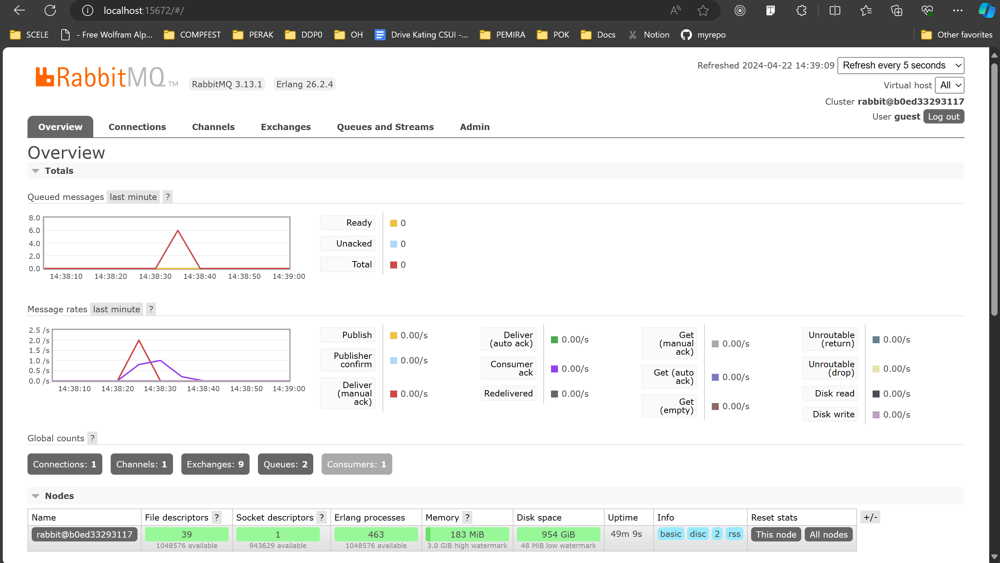
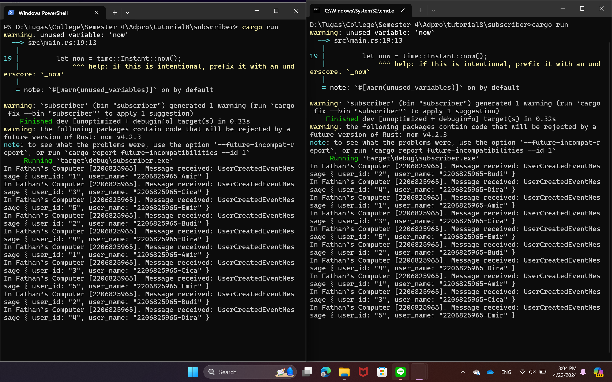
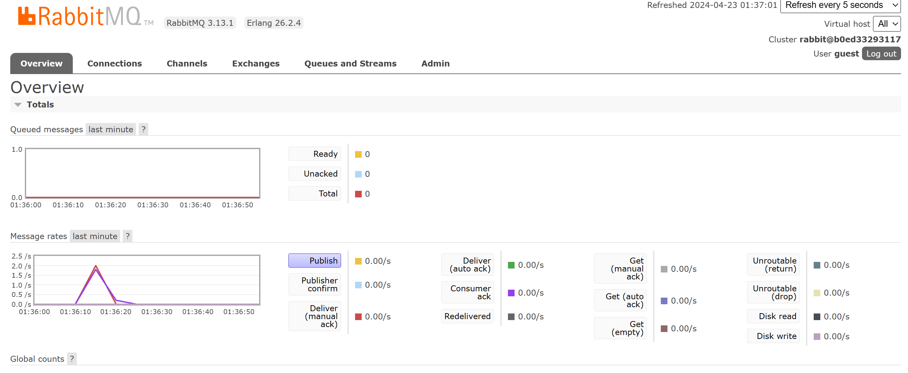

# Tutorial 8 Reflection
> Fathan Naufal Adhitama - 2206825965

1. what is amqp? 
AMQP singkatan dari Advanced Messaging Queuing Prtoocol merupakan desain standar pertukaran pesan (messaging) yang mendukung efisiensi penentuan proses pertukaran pesan (messaging) pada aplikasi atau komunikasi data yang sangat beragam saat ini.
2. what it means? guest:guest@localhost:5672 , what is the first quest, and what is 
the second guest, and what is localhost:5672 is for?  
`guest:guest@localhost:5672` adalah string dengan format URI standar untuk koneksi ke server AMQP. Pada string tersebut, `guest` yang pertama adalah **username** sedangkan `guest` yang kedua adalah **password**. `localhost:5672` adalah alamat dan port number dari server AMQP. `localhost` merujuk kepada local address dari server yang berjalan pada mesin yang sama, dan `5672` adalah port number default yang digunakan oleh server AMQP.

3. Simulation slow subscriber

Berbeda dengan ketika dieksekusi tanpa sleep, terlihat bahwa terdapat spike yang menyentuh angka 6 pada grafik queued message di atas. Hal ini terjadi karena ketika saya menjalankan 2 perintah `cargo run` dengan cepat pada publisher sehingga terdapat 6 pesan yang dikirim perlu dimasukkan ke queue terlebih dahulu.

4. Reflection and Running at least three subscribers

Pada gambar pertama, terlihat bahwa terdapat 3 subscriber yang dijalankan. Dan ketika saya melakukan hal yang sama seperti pada poin nomor 3, yaitu menjalankan 2 perintah `cargo run` dengan cepat, semua pesan yang dikirim dibagi eksekusinya ke 3 subscriber tersebut. Hal ini mengakibatkan grafik yang dihasilkan seperti pada gambar 2. Meskipun dieksekusi dengan sleep, dapat dilihat dari grafik queued messages, sekarang tidak ada message yang masuk ke queue. Hal ini terjadi karena message telah dieksekusi oleh 3 subscriber berbeda sehingga message tidak perlu lagi mengantri di queue untuk dieksekusi.

